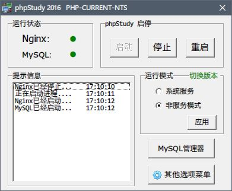
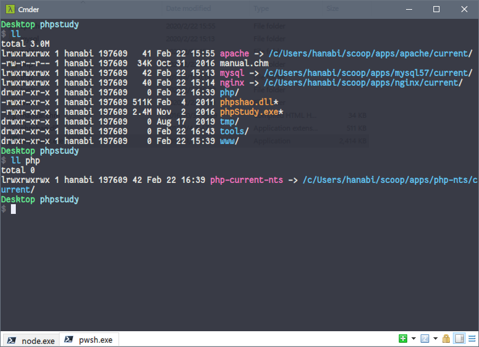

# phpstudy-lagecy-scoop

phpStudy 作为 Windows 平台上一个非常易用的集成开发环境，一直在更新。不过我对 2016
版本仍情有独钟，可以其已经停止维护，里面的 Apache、Nginx、PHP 等组件都已经老久过时，
不过其实它的管理面板仍然非常简洁好用。

鉴于平时绝大部分情况下都在使用 Scoop 管理软件，可以通过 Scoop 很轻易地持续获取更新
版本的 Apache、Nginx、PHP 等软件，故基于 phpStudy 2016 解压版的包体，精简了老久的
Apache、Nginx 等组件，删减了不必须的附件，进行了重打包，方便搭配 Scoop 进行使用。

通过 Scoop 安装的 Apache、Nginx、PHP、MySQL 组件，以软连接的方式链接到 phpStudy 的
目录下，再通过 phpStudy 的面板管理各个组件的启动停止。这样既可得到一个简洁方便的服
务面板，又能持续使用最新的 Apache、Nginx、PHP、MySQL。这是本包体的目的。

## License

phpStudy 包体版权归 phpStudy 原作者所有。
